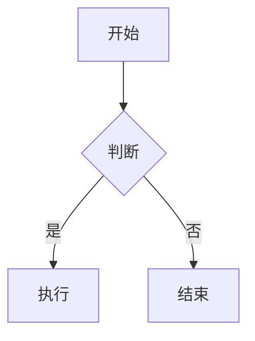

# 插件系统完整指南

mio-previewer 提供了强大的双层插件系统，允许你扩展 Markdown 解析和渲染功能。

## 目录

- [插件系统架构](#插件系统架构)
- [Markdown-it 插件（语法扩展）](#markdown-it-插件语法扩展)
- [自定义渲染插件（Custom Plugins）](#自定义渲染插件custom-plugins)
- [内置插件](#内置插件)
- [完整示例](#完整示例)
- [最佳实践](#最佳实践)

---

## 插件系统架构

插件系统分为两层：

```
┌─────────────────────────────────────────────┐
│  Markdown Text                               │
│  "# Hello **World**"                         │
└──────────────┬──────────────────────────────┘
               │
               ▼
┌─────────────────────────────────────────────┐
│  Layer 1: Markdown-it 插件                   │
│  ● 扩展 Markdown 语法                         │
│  ● 在解析阶段工作                              │
│  ● 输出: HTML 字符串                          │
└──────────────┬──────────────────────────────┘
               │
               ▼
┌─────────────────────────────────────────────┐
│  HTML Parser (htmlparser2)                  │
│  HTML → AST                                 │
└──────────────┬──────────────────────────────┘
               │
               ▼
┌─────────────────────────────────────────────┐
│  Layer 2: Custom 插件                       │
│  ● 自定义节点渲染                             │
│  ● 在渲染阶段工作                              │
│  ● 输出: Vue VNodes                          │
└──────────────┬──────────────────────────────┘
               │
               ▼
┌─────────────────────────────────────────────┐
│  Vue 组件树                                  │
└─────────────────────────────────────────────┘
```

---

## Markdown-it 插件（语法扩展）

### 什么是 Markdown-it 插件？

Markdown-it 插件在 Markdown 解析阶段工作，可以：
- 扩展 Markdown 语法（如：高亮标记 `==text==`、容器语法 `:::warning`）
- 修改解析规则
- 转换 token 流

### 基础用法

```typescript
import type { MarkdownItPluginConfig } from 'mio-previewer'
import markdownItMark from 'markdown-it-mark'
import markdownItContainer from 'markdown-it-container'

const markdownItPlugins: MarkdownItPluginConfig[] = [
  {
    plugin: markdownItMark,
    // 无需 options 时可以省略
  },
  {
    plugin: markdownItContainer,
    options: ['warning', {
      render: (tokens, idx) => {
        if (tokens[idx].nesting === 1) {
          return '<div class="warning">\n';
        } else {
          return '</div>\n';
        }
      }
    }]
  }
];
```

### 在组件中使用

```vue
<template>
  <MdRenderer 
    :md="markdownText"
    :markdownItPlugins="markdownItPlugins"
    :markdownItOptions="{ html: true, linkify: true }"
  />
</template>

<script setup>
import { MdRenderer } from 'mio-previewer';
import { alertPlugin, katexPlugin } from 'mio-previewer/plugins/markdown-it';

const markdownItPlugins = [
  { plugin: alertPlugin },
  { plugin: katexPlugin }
];
</script>
```

### 常用 Markdown-it 插件

| 插件 | 功能 | 语法示例 |
|------|------|---------|
| `markdown-it-mark` | 高亮文本 | `==高亮==` |
| `markdown-it-sub` | 下标 | `H~2~O` |
| `markdown-it-sup` | 上标 | `x^2^` |
| `markdown-it-footnote` | 脚注 | `[^1]` |
| `markdown-it-abbr` | 缩写 | `*[HTML]: Hyper Text Markup Language` |

---

## 自定义渲染插件（Custom Plugins）

### 什么是 Custom 插件？

Custom 插件在 HTML AST → Vue VNodes 渲染阶段工作，可以：
- 拦截特定 HTML 节点
- 自定义渲染逻辑
- 渲染 Vue 组件替代默认 HTML

### 插件接口

```typescript
export interface CustomPlugin {
  name: string;              // 插件名称
  priority?: number;          // 优先级（数字越大越先执行）
  test: (node: ASTNode) => boolean;  // 节点匹配函数
  render: (                   // 渲染函数
    node: ASTNode,
    renderChildren: () => any[],
    h: typeof import('vue').h,
    isStreaming?: boolean
  ) => VNode | string | null;
}

export interface CustomPluginConfig {
  plugin: (options?: any) => CustomPlugin;  // 插件工厂函数
  options?: any;              // 插件配置选项
}
```

### 创建自定义插件

#### 1. 简单示例：高亮插件

```typescript
import { h } from 'vue';
import type { CustomPlugin } from 'mio-previewer';

export function highlightPlugin(): CustomPlugin {
  return {
    name: 'highlight',
    priority: 50,
    test: (node) => node.type === 'tag' && node.name === 'mark',
    render: (node, renderChildren, h) => {
      return h('span', {
        class: 'highlight',
        style: { backgroundColor: 'yellow' }
      }, renderChildren());
    }
  };
}
```

#### 2. 带配置的插件

```typescript
export interface HighlightOptions {
  color?: string;
  className?: string;
}

export function highlightPlugin(options: HighlightOptions = {}): CustomPlugin {
  const { color = 'yellow', className = 'highlight' } = options;
  
  return {
    name: 'highlight',
    priority: 50,
    test: (node) => node.type === 'tag' && node.name === 'mark',
    render: (node, renderChildren, h) => {
      return h('span', {
        class: className,
        style: { backgroundColor: color }
      }, renderChildren());
    }
  };
}

// 使用
const customPlugins = [
  { plugin: highlightPlugin, options: { color: '#ff0', className: 'my-highlight' } }
];
```

#### 3. 渲染 Vue 组件

```typescript
import MyComponent from './MyComponent.vue';

export function myComponentPlugin(): CustomPlugin {
  return {
    name: 'myComponent',
    priority: 100,
    test: (node) => {
      return node.type === 'tag' && 
             node.name === 'div' && 
             node.attribs?.['data-component'] === 'my-component';
    },
    render: (node, renderChildren, h) => {
      return h(MyComponent, {
        title: node.attribs?.title,
        // 传递其他 props
      }, {
        default: () => renderChildren()
      });
    }
  };
}
```

### 在组件中使用

```vue
<template>
  <MdRenderer 
    :md="markdownText"
    :customPlugins="customPlugins"
  />
</template>

<script setup>
import { MdRenderer } from 'mio-previewer';
import { codeBlockPlugin, emojiPlugin, cursorPlugin } from 'mio-previewer/plugins/custom';
import { myCustomPlugin } from './myCustomPlugin';

const customPlugins = [
  { plugin: codeBlockPlugin },
  { plugin: emojiPlugin, options: { style: 'native' } },
  { plugin: cursorPlugin, options: { shape: 'circle', color: '#000' } },
  { plugin: myCustomPlugin }
];
</script>
```

### 插件优先级

插件按 `priority` 值从高到低排序执行。数字越大，优先级越高。

```typescript
const customPlugins = [
  { plugin: pluginA },        // priority: undefined (默认 0)
  { plugin: pluginB, options: { priority: 100 } },  // 最高优先级
  { plugin: pluginC, options: { priority: 50 } }
];

// 执行顺序: pluginB → pluginC → pluginA
```

### ASTNode 结构

```typescript
interface ASTNode {
  type: 'tag' | 'text' | 'component' | 'root' | 'document';
  name?: string;         // 标签名称（type='tag' 时）
  data?: string;         // 文本内容（type='text' 时）
  attribs?: Record<string, string>;  // HTML 属性
  children?: ASTNode[];  // 子节点
}
```

常见节点类型：
- `type: 'tag'` - HTML 标签：`<div>`, `<span>`, `<p>` 等
- `type: 'text'` - 文本节点：纯文本内容
- `type: 'component'` - 自定义组件节点（由插件创建）

---

## 内置插件

mio-previewer 提供了开箱即用的插件。

### Custom 插件

#### 1. Code Block Plugin（代码块）

```typescript
import { codeBlockPlugin } from 'mio-previewer/plugins/custom';

const customPlugins = [
  { plugin: codeBlockPlugin }
];
```

**功能：**
- 语法高亮（Prism.js，支持 20+ 语言）
- 复制代码按钮
- HTML 预览（仅 HTML 代码块）
- 自适应 iframe 高度

#### 2. Emoji Plugin（表情符号）

```typescript
import { emojiPlugin } from 'mio-previewer/plugins/custom';

const customPlugins = [
  { 
    plugin: emojiPlugin,
    options: {
      style: 'native'  // 'native' | 'emoji'
    }
  }
];
```

**使用：**
```markdown
Hello :smile: :heart: :rocket:
```

#### 3. Mermaid Plugin（图表）

```typescript
import { mermaidPlugin } from 'mio-previewer/plugins/custom';

const customPlugins = [
  { 
    plugin: mermaidPlugin,
    options: {
      theme: 'default'  // 'default' | 'forest' | 'dark' | 'neutral'
    }
  }
];
```

**使用：**
````markdown

````

#### 4. Cursor Plugin（光标）

```typescript
import { cursorPlugin } from 'mio-previewer/plugins/custom';

const customPlugins = [
  { 
    plugin: cursorPlugin,
    options: {
      shape: 'circle',  // 'square' | 'line' | 'circle'
      color: '#000'
    }
  }
];
```

**用于流式渲染时显示闪烁光标。**

### Markdown-it 插件

#### 1. Alert Plugin（警告框）

```typescript
import { alertPlugin } from 'mio-previewer/plugins/markdown-it';

const markdownItPlugins = [
  { plugin: alertPlugin }
];
```

**使用：**
```markdown
> [!NOTE]
> 这是一个提示信息

> [!WARNING]
> 这是一个警告

> [!TIP]
> 这是一个小技巧

> [!IMPORTANT]
> 这是重要信息

> [!CAUTION]
> 这是危险警告
```

#### 2. KaTeX Plugin（数学公式）

```typescript
import { katexPlugin } from 'mio-previewer/plugins/markdown-it';

const markdownItPlugins = [
  { 
    plugin: katexPlugin,
    options: {
      throwOnError: false,
      output: 'mathml'  // 'html' | 'mathml'
    }
  }
];
```

**使用：**
```markdown
行内公式：$E = mc^2$

块级公式：
$$
\int_{-\infty}^{\infty} e^{-x^2} dx = \sqrt{\pi}
$$
```

---

## 完整示例

### 基础使用

```vue
<template>
  <div class="markdown-container">
    <MdRenderer 
      :md="markdownText"
      :isStreaming="isStreaming"
      :markdownItPlugins="markdownItPlugins"
      :customPlugins="customPlugins"
    />
  </div>
</template>

<script setup lang="ts">
import { ref } from 'vue';
import { MdRenderer } from 'mio-previewer';
import 'mio-previewer/style.css';

// Markdown-it 插件
import { alertPlugin, katexPlugin } from 'mio-previewer/plugins/markdown-it';

// Custom 插件
import { 
  codeBlockPlugin, 
  emojiPlugin, 
  mermaidPlugin, 
  cursorPlugin 
} from 'mio-previewer/plugins/custom';

const markdownText = ref(`
# 完整功能演示

## 数学公式
行内公式：$E = mc^2$

块级公式：
$$
\\int_{-\\infty}^{\\infty} e^{-x^2} dx = \\sqrt{\\pi}
$$

## 代码高亮
\`\`\`typescript
function greet(name: string): string {
  return \`Hello, \${name}!\`;
}
\`\`\`

## 警告框
> [!NOTE]
> 这是一个提示信息

> [!WARNING]
> 请注意这个警告

## Emoji
Hello :smile: :heart: :rocket:

## 图表
\`\`\`mermaid
graph LR
  A[开始] --> B[处理]
  B --> C[结束]
\`\`\`
`);

const isStreaming = ref(false);

const markdownItPlugins = [
  { plugin: alertPlugin },
  { plugin: katexPlugin }
];

const customPlugins = [
  { plugin: codeBlockPlugin },
  { plugin: emojiPlugin },
  { plugin: mermaidPlugin },
  { plugin: cursorPlugin, options: { shape: 'circle', color: '#000' } }
];
</script>

<style>
.markdown-container {
  max-width: 800px;
  margin: 0 auto;
  padding: 20px;
}
</style>
```

### 流式渲染示例

```vue
<template>
  <MdRenderer 
    :md="streamedText"
    :isStreaming="isStreaming"
    :customPlugins="[{ plugin: cursorPlugin }]"
  />
</template>

<script setup>
import { ref, onMounted } from 'vue';
import { MdRenderer } from 'mio-previewer';
import { cursorPlugin } from 'mio-previewer/plugins/custom';

const streamedText = ref('');
const isStreaming = ref(true);

const fullText = `# 流式渲染演示\n\n这是一段逐字显示的文字...`;

onMounted(() => {
  let index = 0;
  const interval = setInterval(() => {
    if (index < fullText.length) {
      streamedText.value += fullText[index];
      index++;
    } else {
      isStreaming.value = false;
      clearInterval(interval);
    }
  }, 50);
});
</script>
```

---

## 最佳实践

### 1. 插件顺序很重要

```typescript
// ✅ 推荐：按优先级明确排序
const customPlugins = [
  { plugin: cursorPlugin, options: { priority: 100 } },    // 最高
  { plugin: codeBlockPlugin, options: { priority: 80 } },
  { plugin: mermaidPlugin, options: { priority: 60 } },
  { plugin: emojiPlugin, options: { priority: 40 } }       // 最低
];

// ❌ 避免：依赖默认顺序
const customPlugins = [
  { plugin: emojiPlugin },
  { plugin: codeBlockPlugin },
  { plugin: mermaidPlugin }
];
```

### 2. 使用 TypeScript 类型

```typescript
import type { 
  MarkdownItPluginConfig, 
  CustomPluginConfig,
  MdRendererProps 
} from 'mio-previewer';

const markdownItPlugins: MarkdownItPluginConfig[] = [...];
const customPlugins: CustomPluginConfig[] = [...];
```

### 3. 按需导入插件

```typescript
// ✅ 只导入需要的插件
import { codeBlockPlugin, emojiPlugin } from 'mio-previewer/plugins/custom';

// ❌ 避免导入所有插件
import * as plugins from 'mio-previewer/plugins/custom';
```

### 4. 插件配置复用

```typescript
// 创建可复用的配置
export const defaultPluginConfig = {
  markdownItPlugins: [
    { plugin: alertPlugin },
    { plugin: katexPlugin }
  ],
  customPlugins: [
    { plugin: codeBlockPlugin },
    { plugin: emojiPlugin }
  ]
};

// 在多个组件中使用
import { defaultPluginConfig } from './pluginConfig';
```

### 5. 性能优化

```typescript
// 对于大型文档，考虑延迟加载重量级插件
const customPlugins = computed(() => {
  const plugins = [{ plugin: codeBlockPlugin }];
  
  // 只有在需要时才加载 Mermaid
  if (needsDiagram.value) {
    plugins.push({ plugin: mermaidPlugin });
  }
  
  return plugins;
});
```

### 6. 调试技巧

```typescript
// 在插件中添加调试日志
export function myPlugin(): CustomPlugin {
  return {
    name: 'myPlugin',
    test: (node) => {
      const matches = node.type === 'tag' && node.name === 'div';
      if (matches) {
        console.log('myPlugin matched:', node);
      }
      return matches;
    },
    render: (node, renderChildren, h) => {
      console.log('myPlugin rendering:', node);
      return h('div', { class: 'my-plugin' }, renderChildren());
    }
  };
}
```

---

## 常见问题

### 1. 插件没有生效？

**检查清单：**
- ✅ 插件是否正确导入和注册？
- ✅ `test` 函数是否正确匹配节点？
- ✅ 插件优先级是否被其他插件覆盖？
- ✅ 是否在 `markdownItPlugins` 和 `customPlugins` 中混淆了插件类型？

### 2. 如何查看 AST 结构？

在浏览器控制台中：
```javascript
// mio-previewer 会在 window 上暴露调试变量
console.log(window.__mio_last_html__);  // 查看 HTML
console.log(window.__mio_last_ast__);   // 查看 AST
```

### 3. 多个插件冲突怎么办？

使用 `priority` 明确指定执行顺序：
```typescript
const customPlugins = [
  { plugin: pluginA, options: { priority: 100 } },  // 先执行
  { plugin: pluginB, options: { priority: 50 } }    // 后执行
];
```

### 4. 如何在插件中访问 props？

插件无法直接访问父组件的 props，但可以通过 options 传递配置：

```typescript
// 父组件
<MdRenderer :customPlugins="customPlugins" />

<script setup>
const theme = ref('dark');

const customPlugins = computed(() => [
  { 
    plugin: myPlugin, 
    options: { theme: theme.value }  // 通过 options 传递
  }
]);
</script>

// 插件
export function myPlugin(options: { theme: string } = {}) {
  return {
    name: 'myPlugin',
    render: (node, renderChildren, h) => {
      const className = options.theme === 'dark' ? 'dark-mode' : 'light-mode';
      return h('div', { class: className }, renderChildren());
    }
  };
}
```

---

## 参考资料

- [Markdown-it 官方文档](https://github.com/markdown-it/markdown-it)
- [htmlparser2 文档](https://github.com/fb55/htmlparser2)
- [Vue 3 Render Function API](https://vuejs.org/guide/extras/render-function.html)
- [mio-previewer GitHub](https://github.com/Pretend-to/mio-previewer)

---

**相关文档：**
- [自定义代码块样式](./CUSTOMIZE_CODEBLOCK_STYLE.md)
- [KaTeX 数学公式配置](./KATEX_DELIMITERS.md)
